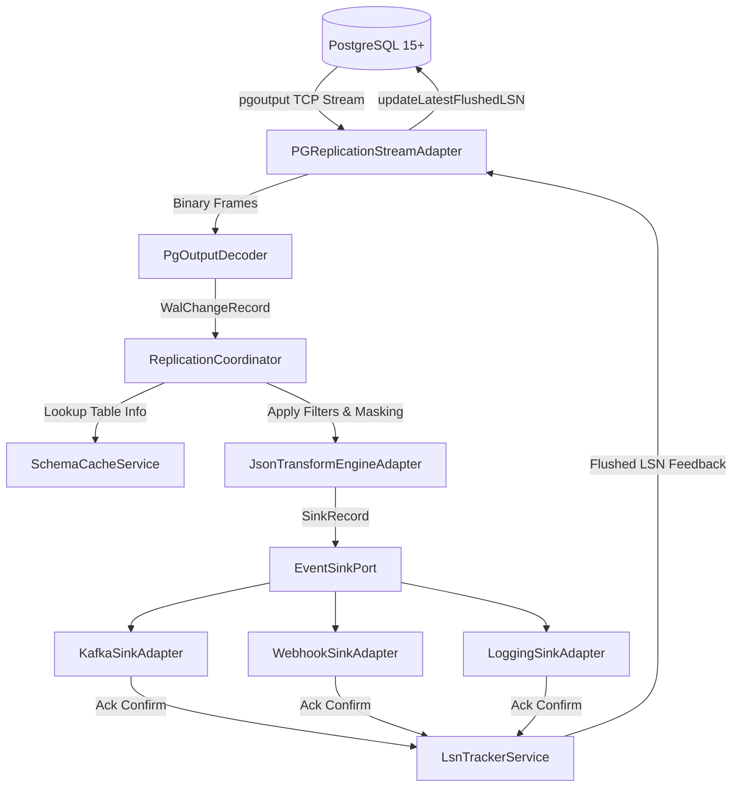

# WalPulse architecture

WalPulse uses hexagonal architecture (ports and adapters) to isolate core business and transformation rules from database drivers, messaging protocols, and web frameworks.

## Architecture overview

The codebase divides into three distinct layers:

1. Domain layer (`com.engine.walpulse.domain`):
   Pure Java 21 without framework imports. Contains core models (`WalChangeRecord`, `TableMetadata`, `ColumnValue`, `LsnPosition`), domain events (`ChangeType`), and port interfaces defining inbound use cases and outbound capabilities.
2. Application layer (`com.engine.walpulse.application`):
   Orchestrates data flow between incoming replication streams, schema caching, payload transformation, and downstream sinks. Manages LSN progression and crash recovery watermarks.
3. Infrastructure layer (`com.engine.walpulse.infrastructure`):
   Contains drivers and framework integrations. Parses PostgreSQL `pgoutput` binary wire format, connects to external sinks (Kafka, HTTP webhooks, logging), runs the control plane REST API, and provides the embedded real-time web dashboard.

## LSN lifecycle and at-least-once delivery

PostgreSQL retains Write-Ahead Logs on disk until all active replication slots confirm they have safely processed and flushed changes.

1. PostgreSQL sends a WAL segment containing one or more transaction boundaries (`BEGIN` to `COMMIT`).
2. The `PgOutputDecoder` translates incoming bytes into typed `WalChangeRecord` instances.
3. The `ReplicationCoordinator` routes records through table inclusion filters and sensitive field masking rules.
4. The destination sink (such as Kafka or HTTP Webhook) transmits the event.
5. Once the sink acknowledges receipt, the `LsnTrackerService` records the position as confirmed.
6. Periodically, the replication adapter sends a standby status update packet back to PostgreSQL with `flushedLsn`.
7. PostgreSQL purges WAL files older than the flushed LSN, preventing log bloat while ensuring no lost events on restart.

## Concurrency model

WalPulse leverages Java 21 Virtual Threads (`java.lang.Thread.ofVirtual()`):

- The replication receiver runs as a continuous virtual thread polling the non-blocking replication stream.
- Event transformations execute in-line with low allocation overhead.
- HTTP/2 webhook dispatches execute on lightweight virtual threads, enabling thousands of concurrent webhook deliveries without thread pool exhaustion.
